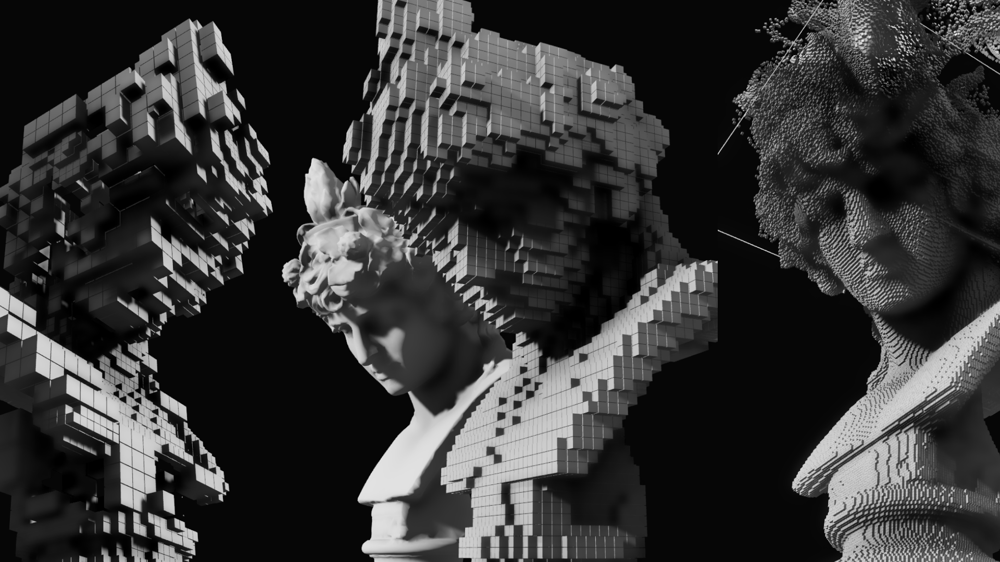

# VL.Voxelizer



A **vvvv gamma** implementation of the mesh voxelization GPU algorithm originally from [mattatz/unity-voxel](https://github.com/mattatz/unity-voxel/tree/master), built using the **VL.Fuse**.

---

## Features

- Compatible with `ComputeSystem` and `GridSpace (3D)` sampling
- Supports arbitrary `AABB` (aka `AlignedBox`)
- Supports `TexCoords` and `Volume` sampling (as in the original implementation)

## Tested On
- VVVV Gamma: `7.0-win`
- VL.Fuse: `1.0.3-beta06`

## Installing
To install the current stable version, type

```
nuget install VL.Voxelizer
```

Then press <kbd>Enter</kbd> and wait for the end of the installation process. 

## Current Status

### Known Issues

- `TexCoords` sampling may produce jittered results between frames depending on the source model data

### Backlog

- [ ] Add support for vertex color sampling
- [ ] Merge shader into one using conditional compilation/effect permutation🤔
- [x] Add more examples
- [x] Execute `IRenderer` operations as part of the `ComputeStage`
- [ ] Replace SDSL implementation with pure `ComputeSystem`🗻
